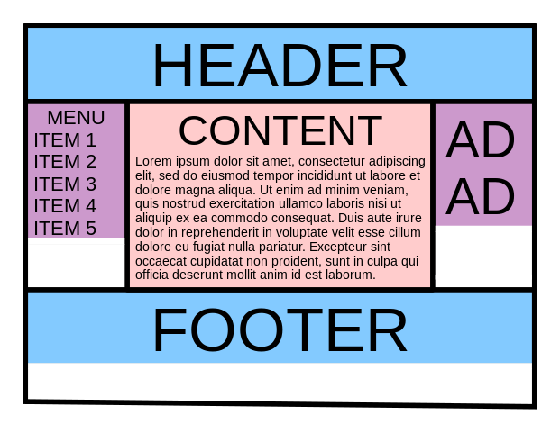

Build this

Holy Grail
There are many great implementations of this layout available for reference, each with its own set of tradeoffs.

Here are a selected few:

This example using Flexbox. https://philipwalton.github.io/solved-by-flexbox/demos/holy-grail/
This example using CSS Grid: https://css-tricks.com/the-holy-grail-layout-with-css-grid/

A few interactive examples:

Flexbox 1
Flexbox 2
Flexbox 3
CSS Grid: https://codepen.io/geoffgraham/pen/yPYKzw

Ref: 
https://stackoverflow.com/questions/643879/css-to-make-html-page-footer-stay-at-bottom-of-the-page-with-a-minimum-height-b

https://web.dev/patterns/layout/holy-grail#css
